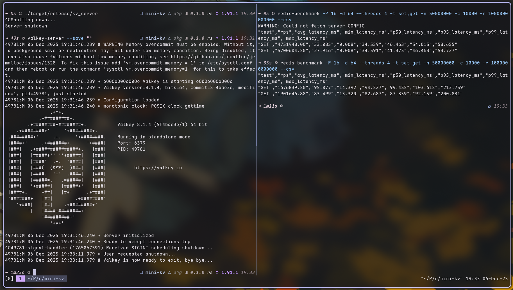
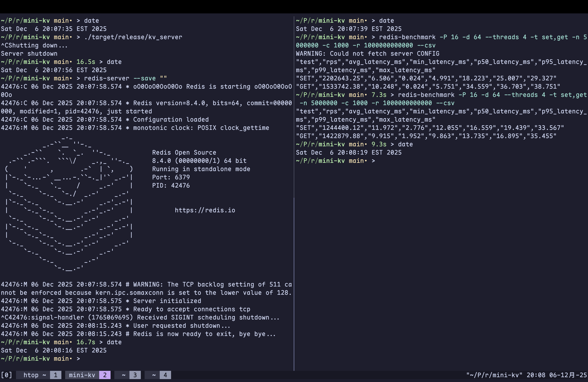

# mini-kv

A mini KV server in Rust.

This is a port from the C project [smb374/redis-c](https://github.com/smb374/redis-c) to make certain things easier to maintain while keeping minimal dependencies and add RESP2 support. See that repo for most of the details.

For the list of commands supported see the C code repo or go to [Build Your Own Redis](https://build-your-own.org/redis/#table-of-contents) to check it as the project and the C code implements the list of commands from the book.

## How to run

Run `cargo build --release` and run `target/release/kv_server` to start the
server. It will bind to `0.0.0.0:6379` by default.

## Features

- No async: The server doesn't use heavy async runtime but uses `mio` and implements event loop directly.
- Small result binary: Under release build it produces a binary less than 1MB for `kv_server` executable.
- Multi-thread: Unlike most of the Redis implementation, the connections are dispatched to 4 worker threads
  and the primary storage is done with a concurrent Hopscotch hashmap with XXH3-64 hashing.
- RESP2 support: The server supports RESP2 protocol so you can use existing clients/CLI with RESP2 to access.

## Dependencies

- [bytes](https://crates.io/crates/bytes): Efficient byte buffer.
- [crossbeam](https://crates.io/crates/crossbeam): Mainly 2 use submodules
  - `epoch` for validated EBR instead of the home-baked QSBR in the C code repo.
  - `channel` for faster inter-thread channel implementation than `std::sync::mpsc`.
- [mio](https://crates.io/crates/mio): Low-level system IO polling mechanism wrapper for implementing non-blocking IO event loop.
- [nix](https://crates.io/crates/nix): Only uses `signal` feature to have safe(r) sigaction for graceful shutdown on `SIGINT` & `SIGTERM`.
- [nom](https://crates.io/crates/nom): Parser combinator library for RESP2 parser.
- [slab](https://crates.io/crates/slab): Slab allocator for connection storage.
- [twox-hash](https://crates.io/crates/twox-hash): Provide XXH3-64 used as hasher for the concurrent hashmap.
- [shuttle](https://crates.io/crates/shuttle): Randomized tests for the concurrent hashmap when feature `shuttle` is enabled for test.

## Design update from previous C code

- Connection & entry expiry are now all handled with a deque, using FIFO-reinsertion like mechanism instead of LRU-like mechanism, reducing complexity and entry expiry now doesn't rely on concurrent skiplist with this.
- ZSet is now implemented by a `HashMap<Arc<str>, f64>` with a `BTreeSet<([u8; 8], Arc<str>)>`. The `[u8; 8]` is obtained by using memcmp friendly encoding on `f64` to use lexicographic order and naturally fits with string comparison.
- Connection is now handled by workers instead of letting main thread does all the IO then dispatch commands to each worker, this has made command pipelining trivial and can be executed in command order. Scheduling is still done by Round-Robin.
- Server now defaults to use 4 instead of 8 workers, resulting in 1+4 configuration.

## Benchmark

Since the server now uses RESP2 it can be benchmarked with `redis-benchmark`.
Below it describes the parameter, hardware, and comparison with [ValKey](https://github.com/valkey-io/valkey), which is the default Redis implementation in Arch Linux's Package Repo.

Note that all the benchmarks run on the same machine running the server, as I
don't have wired connection in my current place.

### Benchmark Parameter

- `-P 16`: pipeline 16 commands in 1 connection.
- `-d 1024`: 1 KB data size
- `--threads 4`: Use 4 threads
- `-t set,get`: Bench `SET` then `GET` with builtin commands
- `-n 5000000`: Total 5M requests
- `-c 200`: 200 Concurrent Clients
- `-r 1000000000000`: Large keyspace ensures high insert-to-update ratio for realistic worst-case testing.

### Hardware & OS

- CPU: Ryzen 5 9600X
- RAM Size: 32 GB
- `uname -a`: `Linux smb374-arch 6.17.9-zen1-1-zen #1 ZEN SMP PREEMPT_DYNAMIC Mon, 24 Nov 2025 15:21:16 +0000 x86_64 GNU/Linux`
- Network: Traffic go through loopback interface

### Results

This repo:

```csv
# redis-benchmark -P 16 -d 1024 --threads 4 -t set,get -n 5000000 -c 200 -r 1000000000000 --csv
"test","rps","avg_latency_ms","min_latency_ms","p50_latency_ms","p95_latency_ms","p99_latency_ms","max_latency_ms"
"SET","3331112.50","0.862","0.008","0.383","3.319","4.039","4.903"
"GET","4995005.00","0.524","0.008","0.311","1.743","2.023","3.655"
```

ValKey (with persistence disabled by passing `--save=""`):

```csv
# redis-benchmark -P 16 -d 1024 --threads 4 -t set,get -n 5000000 -c 200 -r 1000000000000 --csv
"test","rps","avg_latency_ms","min_latency_ms","p50_latency_ms","p95_latency_ms","p99_latency_ms","max_latency_ms"
"SET","2217294.75","1.305","0.544","1.191","2.151","2.407","4.431"
"GET","2497502.50","1.209","0.192","1.167","1.383","2.343","3.711"
```

### C10K performance

While C10K is a solved problem in modern systems, it remains a useful stress
test for comparing architectures under high connection count.

This Repo:

```csv
# redis-benchmark -P 16 -d 64 --threads 4 -t set,get -n 50000000 -c 10000 -r 1000000000000 --csv
"test","rps","avg_latency_ms","min_latency_ms","p50_latency_ms","p95_latency_ms","p99_latency_ms","max_latency_ms"
"SET","4751948.00","33.126","0.008","34.815","41.823","44.959","50.111"
"GET","5543237.00","28.217","0.008","31.519","40.959","42.303","45.983"
```

ValKey:

```csv
# redis-benchmark -P 16 -d 64 --threads 4 -t set,get -n 50000000 -c 10000 -r 1000000000000 --csv
"test","rps","avg_latency_ms","min_latency_ms","p50_latency_ms","p95_latency_ms","p99_latency_ms","max_latency_ms"
"SET","1677233.25","95.130","13.784","94.335","99.775","103.359","248.959"
"GET","1865462.88","84.926","13.920","84.223","89.343","92.863","188.543"
```

Note on Memory Usage: The benchmark used a reduced data size of 64 B because the test involves ~50 million unique inserts, which consumes significant memory.


### 1K concurrent connections from M2 Air

Note that on C10K my M2 Air gets wacky so I didn't include it. The 1K test still beats official Redis though even when GET behaves suboptimal compare to my PC. Also the comparison uses Redis 8.4 from Redis instead of ValKey.

This Repo:

```csv
# redis-benchmark -P 16 -d 64 --threads 4 -t set,get -n 5000000 -c 1000 -r 1000000000000 --csv
"test","rps","avg_latency_ms","min_latency_ms","p50_latency_ms","p95_latency_ms","p99_latency_ms","max_latency_ms"
"SET","1992825.75","6.833","0.024","5.623","15.967","22.703","28.671"
"GET","1424501.38","10.376","0.016","4.775","35.263","37.727","38.911"
```

Redis 8.4:

```csv
# redis-benchmark -P 16 -d 64 --threads 4 -t set,get -n 5000000 -c 1000 -r 1000000000000 --csv
"test","rps","avg_latency_ms","min_latency_ms","p50_latency_ms","p95_latency_ms","p99_latency_ms","max_latency_ms"
"SET","1244709.88","11.858","2.912","11.959","16.207","19.183","32.543"
"GET","1422070.50","9.650","2.392","9.511","13.535","16.399","28.783"
```

## Future Work

- Finish example client in `src/client`.
- Add command line options to support setting host and port other than
  `0.0.0.0:6379` and other configuration.
- Add proper logging system to log info.
- Go with full Redis semantic support or at least similar command format
- Add benchmark for the Rust implementation of the concurrent Hopscotch hashmap and compare it with the results in the C code repo by Google Benchmark.
- Other plans mentioned in the C code repo.

## Screenshots

- Side-by-side comparison with ValKey on C10K test:
  
- 1K concurrent connection bench on M2 Air:
  

## Declare Use of Generative AI

I use generative AI to have design level discussion and test code generation, every piece of implementation
code is directly written by me without copy-pasting from the chats.
